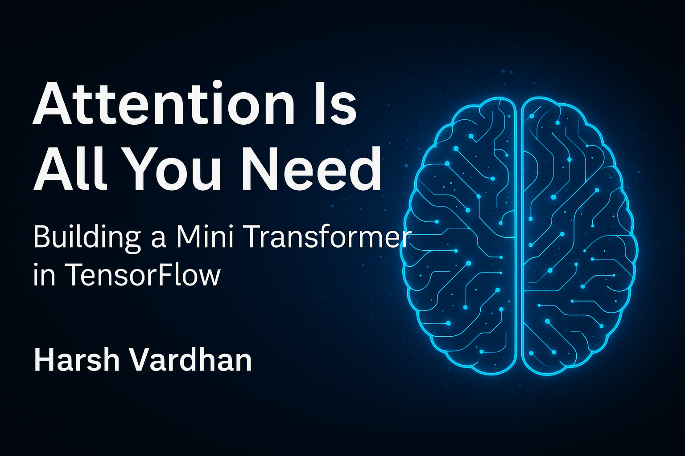

# 🧠 AttentionIsAllYouNeed — Mini Transformer



[](https://www.tensorflow.org/)
[](https://www.python.org/)
[](LICENSE)

A **minimal, educational Transformer Encoder** implementation built from scratch in TensorFlow/Keras. This project demonstrates how **self-attention**, **positional encoding**, and **feed-forward layers** work together to predict the next token in a sequence using a tiny toy dataset.

Perfect for learning the fundamentals of Transformer architecture without the complexity of large-scale implementations.

---

## ✨ Features

- 🔧 **Built from scratch** using low-level TensorFlow (no `Transformer` API shortcuts)
- 🧩 **Complete implementation** of core Transformer components:
  - Tokenization & padding
  - Positional encoding
  - Scaled dot-product attention
  - Multi-head self-attention
  - Transformer encoder layer (with residuals, normalization, dropout)
- 📊 **Custom training loop** with masked loss and accuracy
- 🎯 **Next-token prediction** on a simple word-level corpus
- 🔍 **Attention visualization** for interpretability
- 📚 **Educational focus** with clear, documented code

---

## 📋 Table of Contents

- [Model Overview](#-model-overview)
- [Quick Start](#-quick-start)
- [Model Architecture](#-model-architecture)
- [Training Process](#-training-process)
- [Usage Examples](#-usage-examples)
- [Attention Visualization](#-attention-visualization)
- [Key Concepts](#-key-concepts-learned)
- [References](#-references)
- [License](#-license)

---

## 🏗️ Model Overview

| Component | Purpose |
|-----------|---------|
| **Tokenizer** | Converts words → integer IDs |
| **Embedding Layer** | Converts tokens → dense vectors |
| **Positional Encoding** | Adds position information to embeddings |
| **MultiHeadSelfAttention** | Learns relationships between tokens in sequence |
| **Feed-Forward Network** | Refines each token representation |
| **Residual + LayerNorm** | Stabilizes training and enables deeper networks |
| **Output Dense Layer** | Predicts the next token from context |

---

## 🚀 Quick Start

### Prerequisites

- Python 3.8+
- TensorFlow 2.x
- NumPy
- Matplotlib (for visualization)

### Installation

1. **Clone the repository**
   ```bash
   git clone https://github.com/harshv2013/AttentionIsAllYouNeed.git
   cd AttentionIsAllYouNeed
   ```

2. **Install dependencies**
   ```bash
   pip install -r requirements.txt
   ```

3. **Run training**
   ```bash
   python transformer.py
   ```

### requirements.txt
```
tensorflow>=2.8.0
numpy>=1.21.0
matplotlib>=3.5.0
```

---

## 🧠 Model Architecture

### Toy Corpus

The model is trained on a simple corpus to demonstrate the core concepts:

```python
corpus = [
    "i love deep learning",
    "i love artificial intelligence",
    "deep learning is fun",
    "artificial intelligence is cool",
    "i love models",
    "models learn patterns"
]
```

### Hyperparameters

| Parameter | Value | Description |
|-----------|-------|-------------|
| `d_model` | 16 | Embedding/hidden dimension |
| `num_heads` | 2 | Number of attention heads |
| `num_layers` | 2 | Number of encoder layers |
| `dff` | 64 | Feed-forward hidden dimension |
| `dropout` | 0.1 | Dropout rate for regularization |
| `optimizer` | Adam (lr=1e-3) | Optimization algorithm |
| `epochs` | 1000 | Training iterations |
| `batch_size` | 8 | Mini-batch size |

---

## 🎓 Training Process

### Data Preparation

Each sentence is split into progressive sub-sequences for next-token prediction:

**Example:** `"i love deep learning"`

| Input Sequence | Target Token |
|----------------|--------------|
| `["i"]` | `"love"` |
| `["i", "love"]` | `"deep"` |
| `["i", "love", "deep"]` | `"learning"` |

### Training Loop

1. **Padding:** Inputs are padded to uniform length
2. **Forward Pass:** Model predicts next token for each sequence
3. **Loss Calculation:** Custom masked loss ignores padded positions
4. **Backpropagation:** Gradients computed via TensorFlow's `GradientTape`
5. **Optimization:** Adam optimizer updates model weights

---

## 💡 Usage Examples

### Basic Inference

After training, the model can predict the next word in a sequence:

```python
test_sentence = "i love deep"
# Model processes: tokenize → pad → predict

Predicted next word: 'learning'
```

### Example Predictions

The model learns basic relationships:

- `"i love deep"` → `"learning"`
- `"artificial intelligence"` → `"is"`
- `"models learn"` → `"patterns"`

---

## 🔍 Attention Visualization

Visualize how attention weights focus across tokens:

```python
layer_to_plot = 0
head_to_plot = 0
sample_input = inputs[0:1]

# Get attention weights
_, all_attn = model(sample_input, training=False)
attn_matrix = all_attn[layer_to_plot].numpy()[0, head_to_plot]

# Plot heatmap
plt.imshow(attn_matrix, cmap='viridis')
plt.title(f'Layer {layer_to_plot+1} Head {head_to_plot+1} Attention')
plt.colorbar()
plt.xlabel('Key Position')
plt.ylabel('Query Position')
plt.show()
```

This produces a heatmap showing which tokens attend to others, revealing the model's learned patterns.

---

## 📁 Project Structure

```
AttentionIsAllYouNeed/
├── transformer.py              # Main model + training loop + inference
├── transformer.ipynb           # Interactive Jupyter notebook
├── visualize_attention.py      # Attention heatmap utilities (optional)
├── requirements.txt            # Python dependencies
├── README.md                   # This file
└── LICENSE                     # MIT License
```

---

## 🎯 Key Concepts Learned

Through this implementation, you'll understand:

- ✅ How Transformers process sequences **without recurrence** (no RNNs/LSTMs)
- ✅ Why attention weights are **scaled** and **normalized** (softmax)
- ✅ The critical role of **positional encodings** for sequence order
- ✅ How to implement **custom training loops** with masking in TensorFlow
- ✅ Converting **logits to probabilities** for next-token prediction
- ✅ The mechanics of **multi-head attention** and **residual connections**

---

## 📚 References

- **Paper:** Vaswani et al., ["Attention Is All You Need"](https://arxiv.org/abs/1706.03762), NeurIPS 2017
- **TensorFlow Docs:** [tf.keras.layers.MultiHeadAttention](https://www.tensorflow.org/api_docs/python/tf/keras/layers/MultiHeadAttention)
- **Tutorial:** [The Annotated Transformer](http://nlp.seas.harvard.edu/2018/04/03/attention.html) by Harvard NLP

---

## 👨‍💻 Author

**Harsh Vardhan**

Built for educational understanding of attention mechanisms and Transformer internals.

📍 Follow me on [LinkedIn](https://www.linkedin.com/in/harsh-vardhan-60b6aa106/)  
💻 Check out my [GitHub](https://github.com/harshv2013) for more projects  
📧 Contact: harsh2013@gmail.com


---

## 📄 License

MIT License © 2025 Harsh Vardhan

Free to use, modify, and learn from.

---

## 🤝 Contributing

Contributions, issues, and feature requests are welcome! Feel free to check the [issues page](https://github.com/yourusername/AttentionIsAllYouNeed/issues).

---

## ⭐ Show Your Support

If this project helped you understand Transformers better, give it a ⭐️!

---

<div align="center">
  <sub>Built with ❤️ for the AI learning community</sub>
</div>